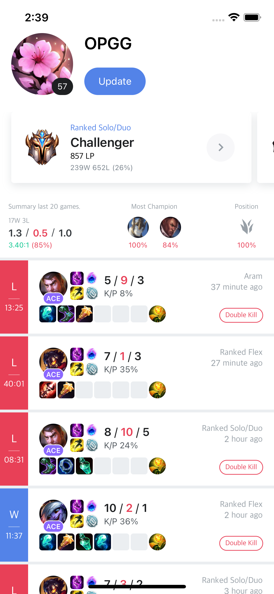
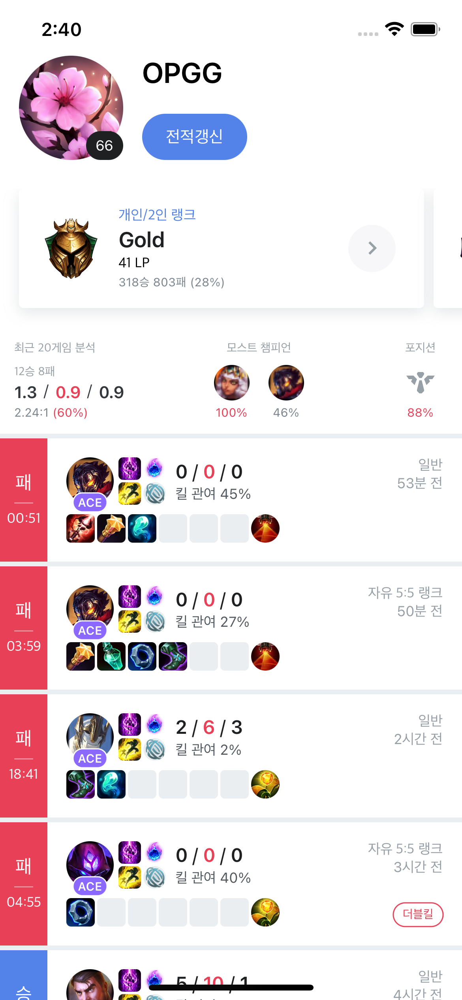

# OPGG

------

## Project Setting

### System

* Xcode 13.3.1
* Swift 5
* iOS 10.0

### Architecture

* MVVM

### Network

* Alamofire

### UI

* CodeBase + UIKit, 
* SnapKit

### Third-Party

- SwiftLint
- Kingfisher
- Then
- WeakMapTable
- RxAppState

------

## 프로그래밍 요구사항

- [x] 테스트API 를사용하여 데이터를 가져옵니다.
- [x] 전적갱신을 터치하면 다시 데이터를 가져옵니다.
- [x] 티어가 보여지는 화면은 가로 스크롤됩니다.
- [x] 모스트 승률은 챔피언 승률 상위2개의 챔피언으로 구성됩니다.
- [x] Load more 기능을구현해주세요.

------

## 실행화면

